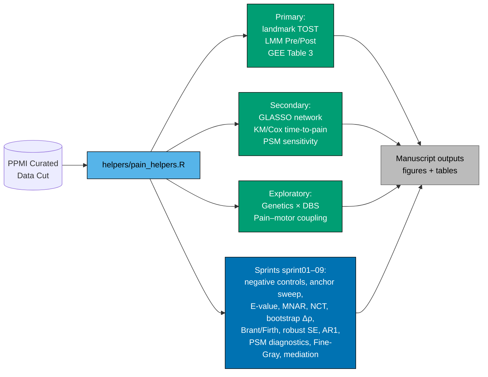

# ppmi-dbs-pain

[](LICENSE)
[](LICENSE-figures.md)
[](https://www.r-project.org/)
[](REPRODUCE.md)

> **Deep brain stimulation does not worsen the longitudinal course of pain in Parkinson disease — and reshapes the symptom network around it.**
> Pacheco-Barrios *et al.*, in preparation.

A propensity-matched longitudinal observational analysis in the **Parkinson's
Progression Markers Initiative (PPMI)** cohort (n = 1,484; 105 DBS, 1,379
Never-DBS) testing non-inferiority of DBS on MDS-UPDRS Part I item 9 pain
trajectories, plus pre-specified and post-hoc robustness checks
(target-trial framing, E-values, MNAR tipping-point, GLASSO network comparison,
competing-risk Fine-Gray, ΔLEDD mediation, negative-control outcomes).

> *PPMI does not record stimulation target; the cohort is therefore treated
> as DBS-agnostic. All references to "DBS" below mean PPMI-recorded DBS
> exposure, target unspecified.*

## 🌐 Companion website

- 📊 **[Interactive results dashboard](https://nielspac177.github.io/ppmi-dbs-pain/dashboard.html)**
  — KPI cards + 9 sprint panels (Plotly + Tailwind, WCAG 2.2 AA accessible).
- 🌊 **[Cohort / analysis Sankey (interactive)](https://nielspac177.github.io/ppmi-dbs-pain/Figure_sankey.html)**
  *(local: `outputs/figures/Figure_sankey.html`)*.
- 📘 **[Quarto book](https://nielspac177.github.io/ppmi-dbs-pain/)** —
  Methods, Results, Sensitivity, DAG, STROBE / TRIPOD / ROBINS-I checklists
  *(builds after `quarto render` — chapter skeletons under `docs/`)*.

---

## Key findings (summary)

- **Primary**: TOST landmark Δ Pain non-inferior at ±1 MDS-UPDRS-I point over 4 years.
- **Network reorganization**: late-post Network Comparison Test P = 0.050 — DBS vs Never-DBS symptom networks structurally differ at long follow-up.
- **Pain–motor decoupling**: bootstrap Δρ = −0.16 (matched 95 % CI −0.60, +0.29; full −0.47, +0.15) — directional but underpowered.
- **Competing-risk Fine-Gray HR** (DBS vs Never-DBS, reaching pain ≥ 2) = **1.86 (1.28–2.69), P = 0.001** — replicates the original Cox HR with proper handling of informative dropout.
- **ΔLEDD does not mediate** the pain effect (matched ACME P = 0.69, full P = 0.07) — argues against a purely pharmacological explanation.

---

## Quick start (no PPMI access required)

```bash
# 1. Clone
git clone https://github.com/nielspac177/ppmi-dbs-pain.git
cd ppmi-dbs-pain

# 2. (a) Devcontainer / Codespaces — recommended
#    Click "Code → Codespaces → Create" on GitHub.
#    Everything (R 4.5.1, all CRAN packages, Quarto) preinstalled.

# 2. (b) Local Docker
docker build -t ppmi-dbs-pain .
docker run --rm -v "$(pwd)":/work ppmi-dbs-pain make all

# 2. (c) Local R installation
Rscript -e 'renv::restore()'
make all       # runs on the synthetic fixture by default
```

The pipeline runs end-to-end on the **synthetic fixture** (`data-synth/`) in
about 15 minutes, regenerating all figures and tables under `outputs/`. See
[REPRODUCE.md](REPRODUCE.md) for step-by-step instructions.

---

## Reproducing the published results

The synthetic fixture is **not real PPMI data** — it preserves variable
names and rough distributions but cannot reproduce manuscript numbers.

To reproduce manuscript figures and tables exactly:

1. Apply for PPMI access at <https://www.ppmi-info.org/access-data-specimens/download-data>.
2. Download the **November 2024 Curated Data Cut**.
3. Copy the four relevant files (see [data-access.md](data-access.md)) into a local folder.
4. `cp config.example.yml config.yml`, edit paths, set `use_synth: false`.
5. `make all`

---

## Repository structure

```
R/                          production R analysis code
  helpers/pain_helpers.R    here()-driven shared utilities
sprints/                    9 robustness-analysis scripts (sprint01–09)
notebooks/                  ~36 Jupyter notebooks (primary pipeline)
scripts/                    Python build scripts (figures, docx, callgraph)
tests/testthat/             unit tests (anchor logic, POSIXct fix, …)
data-synth/                 synthetic PPMI-shaped fixture
docs/                       Quarto book — methods, results, sensitivity
ppmiTTE/                    extracted R package skeleton
                            (target-trial-emulation framework, WIP)
shiny-app/                  interactive nomogram explorer (WIP)
outputs/                    .gitignored — rebuilt by `make all`
outputs/aggregated/         PPMI-DUA-safe summary tables (committed)
archive/                    historical patches; superseded by helpers
```

A pipeline overview as a Mermaid graph lives in
[`callgraph_overview.mmd`](callgraph_overview.mmd); the full callgraph
(295 nodes) is in [`callgraph.mmd`](callgraph.mmd) and as a rendered
PNG in `outputs/figures/Figure_callgraph.png`.

The causal DAG that motivates the propensity / mediation / competing-risk
analyses is in [`outputs/aggregated/causal_dag.txt`](outputs/aggregated/causal_dag.txt)
(dagitty syntax — paste into <https://dagitty.net> to view interactively)
and `outputs/figures/Figure_causal_DAG.png`.

---

## Pipeline overview



---

## Citation

If you use this code, please cite the manuscript (in preparation) and the
software release:

```text
Pacheco-Barrios K, …, Rolston JD.
Stimulation reshapes the pain–symptom architecture in Parkinson disease.
GitHub https://github.com/nielspac177/ppmi-dbs-pain  (vX.Y.Z, DOI 10.5281/zenodo.XXX)
```

See [CITATION.cff](CITATION.cff) for the GitHub-rendered "Cite this repository" button.

---

## License

- **Code** — MIT (see [LICENSE](LICENSE)).
- **Figures / aggregated outputs / text excerpts** — CC-BY-4.0 (see [LICENSE-figures.md](LICENSE-figures.md)).
- **Raw PPMI data** — *not redistributed.* See [data-access.md](data-access.md).

---

## Acknowledgements

PPMI is sponsored by The Michael J. Fox Foundation for Parkinson's Research
and funding partners. We thank PPMI participants and investigators. This work
was conducted as part of the Rolston Lab DBS/PD program.

We welcome adversarial collaborators — see [CONTRIBUTING.md](CONTRIBUTING.md).
