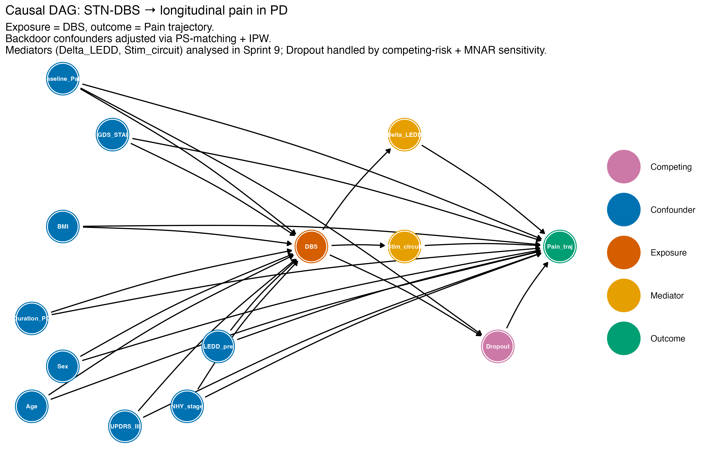

The directed acyclic graph (DAG) below was constructed in `dagitty` and
specifies the causal assumptions of the analysis. The full source is at
[`outputs/aggregated/causal_dag.txt`](../outputs/aggregated/causal_dag.txt).

{fig-align="center" width="90%"}

## Minimal adjustment set

For the **total effect** of DBS on the pain trajectory:

```
{Age, BMI, Baseline_Pain, Duration_PD, GDS_STAI, LEDD_pre, NHY_stage, Sex, UPDRS_III}
```

The primary propensity model includes 7 of these 9. The two additional
variables (`Baseline_Pain`, `GDS_STAI`) are added in the Supplementary
Table S1 sensitivity analysis.

For the **direct effect** of DBS (excluding mediation through Δ LEDD and
stimulation circuit):

```
{Age, BMI, Baseline_Pain, Delta_LEDD, Dropout, Duration_PD, GDS_STAI,
 LEDD_pre, NHY_stage, Sex, Stim_circuit, UPDRS_III}
```

## Interactive view

Paste the contents of `outputs/aggregated/causal_dag.txt` into
<https://dagitty.net> to explore the implied conditional independencies
interactively.
